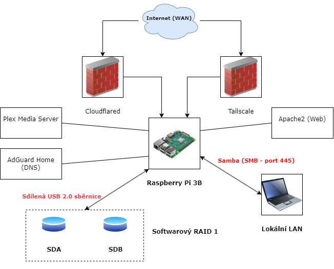

Martine, tady to máš v jednom kuse. Zkopíruj všechno od prvního do posledního řádku v bloku níže a vlož to do svého `README.md`. 

```markdown
# Zachnet Home Server Project
**Autor:** Martin Zach | SPŠE Ječná | Projekt do předmětu PSS

Toto je dokumentace k mému soukromému domácímu serveru, který běží na Raspberry Pi. Cílem projektu bylo vytvořit multifunkční platformu pro hostování soukromých služeb, které jsou bezpečně přístupné odkudkoli na světě, a to vše bez nutnosti mít veřejnou IP adresu.

---

## 1. Topologie sítě a Architektura




---

## 2. Hardware a Fyzické limity (Bottleneck)

* **Server:** Raspberry Pi 3 Model B (armhf, 32-bit, 1 GB RAM)
* **Úložiště:** Softwarový RAID 1 (mirroring) vytvořený pomocí `mdadm`, který se skládá ze dvou externích USB disků. Systémový disk je microSD karta.
* **Síť:** Připojeno 100Mb/s Ethernet kabelem k routeru O2 Smart Box.

**Analýza výkonu (Hardware Bottleneck):**
Jako "Proof of Concept" funguje systém stabilně (uptime >60 dní). Architektura RPi 3B však využívá řadič SMSC LAN9514, což znamená, že **Ethernet (10/100) i všechny čtyři USB 2.0 porty sdílejí jedinou interní sběrnici**. Při souběžném čtení z RAID pole a odesílání dat do sítě vzniká fyzický konflikt, který omezuje reálnou přenosovou rychlost NASu přes Sambu na cca **10-12 MB/s**.

---

## 3. Konfigurace Úložiště (Softwarový RAID)

Pro zajištění redundance dat při selhání disku je nasazen softwarový RAID 1. 

**Aktuální stav pole (`/proc/mdstat`):**
```text
Personalities : [raid0] [raid1] [raid6] [raid5] [raid4] [raid10] 
md0 : active raid1 sdb[1] sda[0]
      60048384 blocks super 1.2 [2/2] [UU]
      bitmap: 0/1 pages [0KB], 65536KB chunk
```
Pole (`/dev/md0`) o kapacitě 57 GB je plně synchronizované `[UU]`, naformátované na EXT4 a trvale připojené do `/mnt/raid` přes `/etc/fstab`.

---

## 4. Software (Server) a NAS

* **Operační systém:** Raspberry Pi OS (Debian 12 "Trixie") headless
* **Webový server (Pro Hub):** Apache2
* **Souborový server (Lokální NAS):** Samba
* **Souborový server (Vzdálený):** FileBrowser
* **Mediální server:** Plex Media Server
* **Blokátor reklam:** AdGuard Home
* **Vzdálený přístup:** Cloudflare Tunnel (`cloudflared`) a Tailscale (Mesh VPN)

**Konfigurace Samby (`/etc/samba/smb.conf`):**
Přístup je striktně omezen na autentizovaného uživatele.
```ini
[NAS]
        create mask = 0777
        directory mask = 0777
        path = /mnt/raid
        read only = No
        valid users = zach
```

---

## 5. Síťová konfigurace a služby

Toto je jádro celého projektu. Místo nebezpečného otevírání portů (Port Forwarding) na routeru je celý server připojen k internetu pomocí **Cloudflare Tunnel**.

### Cloudflare Tunnel (`cloudflared`)

Služba `cloudflared` běží přímo na Raspberry Pi a vytváří trvalý, šifrovaný tunel do sítě Cloudflare. Všechny mé veřejné domény jsou směrovány tímto tunelem na lokální služby běžící na Pi.

Konfigurace tunelu (`config.yml`):
```yaml
tunnel: 3e1b4697-2c02-47a9-baa5-ae27b16fed73
credentials-file: /etc/cloudflared/3e1b4697-2c02-47a9-baa5-ae27b16fed73.json

ingress:
  # Hlavní Hub (Apache)
  - hostname: zachnet.cz
    service: http://localhost:80
  
  # Webový NAS (FileBrowser)
  - hostname: nas.zachnet.cz
    service: http://localhost:8080

  # Panel AdGuardu
  - hostname: adguard.zachnet.cz
    service: http://localhost:8081

  # Vzdálený terminál
  - hostname: ssh.zachnet.cz
    service: ssh://localhost:22

  # Koncové pravidlo
  - service: http_status:404
```

### Přehled hostovaných služeb

| Veřejná adresa | Lokální cíl (Port) | Software | Účel |
| --- | --- | --- | --- |
| `https://zachnet.cz` | `localhost:80` | Apache2 | Hlavní rozcestník (Hub) |
| `https://nas.zachnet.cz` | `localhost:8080` | FileBrowser | Vzdálený přístup k souborům (NAS) |
| `https://ssh.zachnet.cz` | `localhost:22` | OpenSSH + CF Access | Vzdálený terminál (SSH) v prohlížeči |
| `https://adguard.zachnet.cz`| `localhost:8081` | AdGuard Home | Administrace blokátoru reklam |
| `http://10.0.1.106:32400` | `localhost:32400` | Plex Media Server | Lokální mediální server (Netflix) |
| `10.0.1.106` (Lokálně) | `port 53` | AdGuard Home | DNS server pro blokování reklam v síti |
| `\\RASPBERRYPI\NAS` | `port 445` | Samba | Rychlý lokální přístup k disku (disk Z:) |

### Zabezpečení

* **Žádné otevřené porty** na routeru.
* Veškerý webový provoz (`zachnet.cz`, `nas.zachnet.cz`...) je chráněn **Cloudflare WAF a DDoS ochranou** (zdarma).
* Přístup k citlivým službám (jako `ssh.zachnet.cz`) je řízen přes **Cloudflare Zero Trust (Access)**, který vyžaduje přihlášení a ověření e-mailem (One-Time-PIN).
* Nasazena Mesh VPN **Tailscale** jako sekundární vrstva pro bezpečný lokální přístup v případě výpadku Cloudflare.
```
